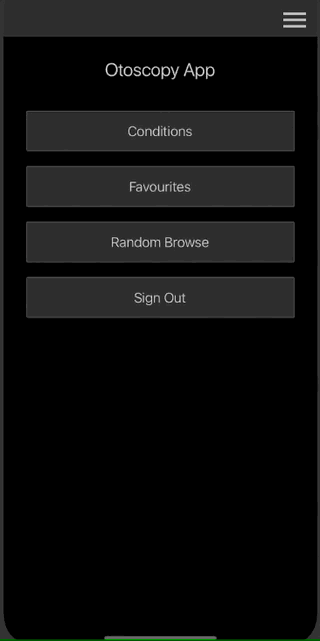

# Otoscopy App

An app for learning about condition of the inner ear. Mimicking the conditions
of making a diagnosis during an ear exam, through an otoscope.


## Features

- Browse slides of otoscope views of the ear;
- Toggle the otoscope to mimic an actual ear examination;
- Toggle the diagnosis notes to view information about the ear;
- Comprehensive notes on specific conditions and categories of conditions;
- Add slides to favourites to create personal learning experience.



## Developing

To run the app in development mode, run

```bash
npx react-native start
```

Then in another terminal run either:

```bash
npx react-native run-ios
```

or,

```bash
npx react-native run-android
```

Depending on which platform you would like to run development mode in.

## Notes

This app was created following the React Native tutorial. See instructions
followed here: https://reactnative.dev/docs/environment-setup

## Icons

SVG isn't so easy in app development so the icons are all supplied using a
custom font called _otoicon_.

To add additional icons to the custom font that is used, please see the
instructions in the `components/design/icons/index.tsx` file.
